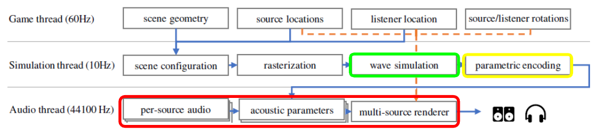

GPUVerb
==================================
- Names

**University of Pennsylvania, CIS 565: GPU Programming and Architecture, Final Project**

# Background
Currently, the landscape of audio in real-time environments, like video games, requires heavy precomputing to accurately represent the real nature of sound. In dynamic environments, precomputing for scenes becomes a logistical impossibility. The paper [Interactive sound propagation for dynamic scenes using 2D wave simulation](https://www.microsoft.com/en-us/research/uploads/prod/2020/08/Planeverb_CameraReady_wFonts.pdf) and its corresponding Unity plugin [Planeverb](https://github.com/themattrosen/Planeverb/tree/master/), addresses this by enabling use of realistic and dynamic acoustics for real-time environments. 

GPUVerb accelerates the speed of the aforementioned paper and its implementation by moving the logic of its core components from CPU to GPU. Unlike Planeverb, GPUVerb is also fully integrated into Unity's sound engine, through Unity's supplied [Spatializer SDK](https://docs.unity3d.com/Manual/AudioSpatializerSDK.html).

# Overview
There are three primary components to GPUVerb.

- Green([Finite-difference time-domain solver](https://en.wikipedia.org/wiki/Finite-difference_time-domain_method)):
  - **Input**: scene geometry
  - **Output**: particle velocities and pressure in discretized scene grid
- Yellow(Analyzer):
  - **Input**: particle velocities and pressure in discretized scene grid(FDTD output)
  - **Output**: acoustic parameters
- Red(Digital signal processor)
  - **Input**: acoustic parameters(analyzer output) + audio signal(s)
  - **Output**: transformed audio signal(s)

Below is a flowchart of how this would operate within a game engine.  

The finite-difference time-domain(FDTD) solver allows us to accurately simulate the wave-based nature of sound. This is built on-top of the existing Planeverb implementation, which we use for fetching of scene geometry in Unity. The FDTD simulation itself is moved from CPU to Unity's compute shaders. (more here?)

The analyzer is wholly based on the implementation described in the paper. (Compute shader usage?)

The digital signal processor is built entirely within the framework of Unity's Spatializer SDK, which is in turn built on Unity's Native Audio SDK. Essentially, a C++ is build into a .dll to be incorporated into the Unity framework as a per-source spatializing plugin. 
