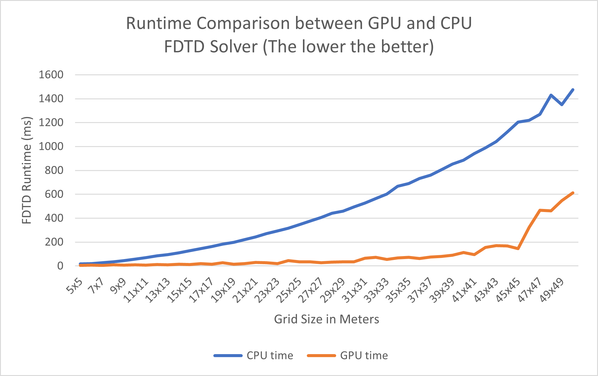

GPUVerb
==================================
**University of Pennsylvania, CIS 565: GPU Programming and Architecture, Final Project**

For a rough summary of GPUVerb, see the [final presentation slide deck](https://docs.google.com/presentation/d/1_dvESQ91yGhgWl9Ghrnkg49GWdWTlzv3eApd4zdJ_No/edit?usp=sharing).

Evan S, Runshi Gu, Tongwei Dai

Plugin built for for: Windows 10/11 (x64)  
Tested on
- Windows 10, Ryzen 7 4800H @ 2.9 GHz, RTX 3050 (Laptop)
- Windows 10, Ryzen 7 5800X @ 3.80 GHz 32GB, RTX 3070 (Desktop)
## Background
Realistic audio is highly expensive to simulate. In real-time environments, like video games, this requires heavy precomputing to accurately represent the real nature of sound. In dynamic environments, precomputation is a logistical impossibility. The paper [Interactive sound propagation for dynamic scenes using 2D wave simulation](https://www.microsoft.com/en-us/research/uploads/prod/2020/08/Planeverb_CameraReady_wFonts.pdf) and its corresponding Unity plugin [Planeverb](https://github.com/themattrosen/Planeverb/tree/master/), addresses this by enabling use of realistic and dynamic acoustics for real-time environments. 

GPUVerb accelerates the speed of the aforementioned paper and its implementation by moving the logic of its core components from CPU to GPU. Unlike Planeverb, GPUVerb is also fully integrated into Unity's sound engine, through Unity's supplied [Spatializer SDK](https://docs.unity3d.com/Manual/AudioSpatializerSDK.html).

## Overview
There are three primary components to the original Planeverb, and GPUVerb by extension.

- Green([Finite-difference time-domain solver](https://en.wikipedia.org/wiki/Finite-difference_time-domain_method)):
  - **Input**: scene geometry
  - **Output**: particle velocities and pressure in discretized scene grid
- Yellow(Analyzer):
  - **Input**: particle velocities and pressure in discretized scene grid(FDTD output)
  - **Output**: acoustic parameters
- Red(Digital signal processor)
  - **Input**: acoustic parameters(analyzer output) + audio signal(s)
  - **Output**: transformed audio signal(s)

Below is a flowchart of how this would operate within a game engine.  

### Finite Difference Time Domain (FDTD) Solver
The FDTD solver allows us to accurately simulate the wave-based nature of sound. The scene geometry is first rasterized to a 2D plane fixed at the listener's head position. 

Then 2D sound wave propagation is simulated within this plane, as an approximation of the simulation in 3D. We optimize the FDTD solver further by moving some computation from CPU to GPU (using Unity compute shader). Analysis of this optimization can be found in the [Performance Analysis Section](#performance-analysis).

Below is a simple visualization of the pressure output of the solver.

### Analyzer
The analyzer is mainly based on the implementation described in the paper. Each analyzer grid cell takes in the chain of samples at the corresponding cell from FDTD grid output, and then we process and calculate those physics data into acoustic parameters which can be used for digital signal processing. The calculations are mainly divided into two parts:
- encoding acoustic response into parameters (e.g., dry & wet gains, RT60, sound directivity)
- encoding listener direction (dependent on acoustic response parameters) 

We further optimize the analyzer solver by moving calculations at each data cell from CPU to GPU (using Unity compute shader). Other changes include an overhaul of the general analyzer code and improved analyzer grid indexing. Performance analysis of the optimizations can be found in the [Performance Analysis Section](#performance-analysis).

### Digital Signal Processor (DSP)
Planeverb's original digital signal processor (DSP) hijacks Unity's audio system, which may not be desirable. The DSP used here is built with Unity's Spatializer SDK, which is in turn built on Unity's Native Audio SDK. Essentially, a C++ processor is built into a .dll to be incorporated into the Unity engine as a per-source spatializing plugin. The core functionality of this is similar to Planeverb's DSP, with additional changes like 3D distance attenuation and smoothing of audio discontinuties based on listener and source movement. 

The code used to build the DSP into .dll can be found [here](https://github.com/GPUVerb/NativeDSPSandbox/tree/spatialize_focus/NativeCode).

## Performance Analysis
### FDTD Solver using Compute Shader
Our GPU implementation of the FDTD solver parallelizes the computations of update equations of each iteration.

Specifically, each cell in the grid updates its data in parallel based on its own data and the data of the neighboring cells from the previous iteration.

The process is almost embarassingly parallel. Dependency within the grid is minimal, as each cell would need to fetch data from 4 of its closest neighbors.

To test whether the GPU FDTD solver outperforms the original Planeverb implementation, we measure the time it takes to simulate the propagation of a single Gaussian pulse as grid size increases, for both implementations. Naturally, the lower the runtime, the more efficient the implementation.
- The hardware used for this test is i7-8700 @ 3.20 GHz 16GB and RTX 2070
- Free parameters that impact solver accuracy and performance are set to be the same for both GPU and CPU implementations.

The result shows that the GPU implementation scales much better with grid dimension. 

This makes it possible to simulate wave propagation in relatively large scenes. Because the FDTD solver is run every time the listener or a sound source moves, a running time greater than 400ms may cause noticeable delay in the audio output.

### Optimizing GPU Usage
With the power of parallel computing, we are able to effectively reduce the runtime of the FDTD solver.

However, it is also important to take into account the resultant GPU usage, because in a common use case of our pipeline(i.e. video games), rendering workloads can account for a siginificant percentage of GPU usage. The audio simulation should not starve or lag other GPU workloads in the application.

By default, the simulation thread runs at 10 Hz, so the FDTD solver will run every 0.1 seconds. A naive implementation would dispatch all the FDTD workload at once every 0.1 seconds, resulting in periodic spikes of GPU usage. In a large grid (e.g. 30x30 meters), this will sometimes lag the rendering process, which is not practical.

We tackle this problem by spreading the FDTD workloads across multiple simulation frames, so the FDTD computation will span the whole 0.1 seconds if the simulation frequency is 10hz. Basically, we "even out" the large GPU usage of the FDTD solver.

To test how much performance gain this optimization brings, we set up a sample scene(image below) that is representative of a simple 3D video game. The scene uses a large 50x50 grid.
- The hardware used for this test is i7-8700 @ 3.20 GHz 16GB and RTX 2070
- The simulation thread is configured to run at 10 Hz

The following table shows the average GPU usage difference of the naive implementation and the implementation with the above optimization.

|| Naive      | Load Balancing |
|--| -----------| ----------- |
|GPU Usage| 46.3%      | 35.9 %      |

### Analyzer Solver using Compute Shader
Our GPU implementation of the analyzer solver parallelizes the computations of acoustic parameters at each cell. The runtime of GPU Analyzer stays almost constant from 5x5 to 50x50 meters grid(~3-10 ms), while the original CPU implementation has a exponential increase in runtime relative to grid size.

Test results below are run on mid-resolution grids with a 10 Hz simulation thread, run on Windows 10, Ryzen 7 5800X @ 3.80 GHz 32GB, RTX3070 (Desktop)

